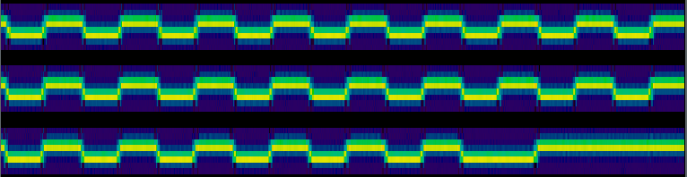
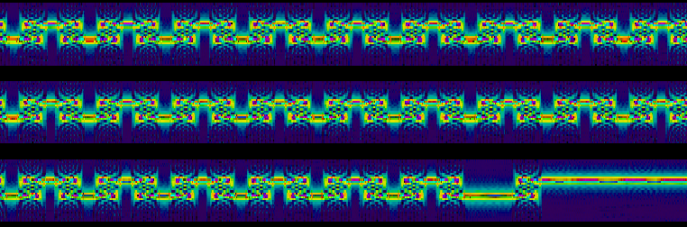
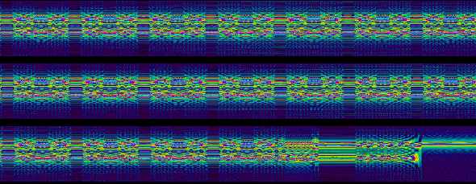
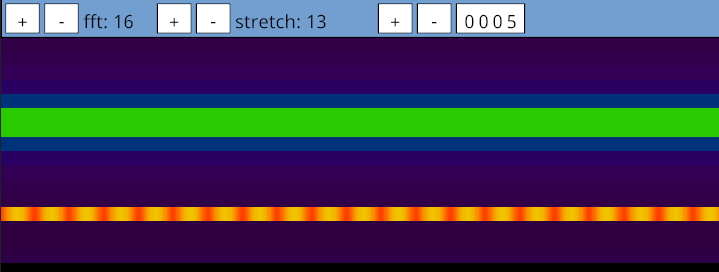
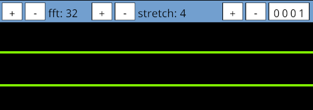

## What?

A "Fast Fourier Transform" is a function that takes a "slice" of a stream
of samples, and generates a representation of the frequencies present.

They have one parameter, called "width".

The "width" is both the number of samples that are input, and the number of
distinct frequency buckets that can be observed in the output.

I think of it like this (ignoring the complex numbers for now!):

 * `stream`: your list of samples, a 1d array of magnitudes.
 * `output`: a breakdown of the frequencies from point `X` in the
    stream, until the end of the slice.
 * `slice`: a section of the string, `fft-width` in length.

As an ASCII art diagram, this would look like:

```
         <----- slice 1 -----><---- gap ----><----- slice 2 -----><-- gap...
stream:  X~~###~~-~-~-#~#~###~#--~####~~~#--~X-~~#--~#--~#---~~~##--~#...
     ^   |                                   |
     |   #                                   #
     |   #                                   #
     |   |                                   |
  output |                                   |
     |   #                                   #
     |   |                                   |
     |   #                                   #
     v   #                                   |
```

The output view shown by most tools is generated by concatenating all of
these outputs into an image, discarding the spacing.

Note that you can have overlap:

```
         <----- slice 1 -----><----- slice 3 -----><----- slice 5..
                    <----- slice 2 -----><----- slice 4 -----><---..
stream:  X~~###~~-~-X~-#~#~###X#--~####~~X#----~#~~X-~~~###--~#X-~#--
     ^   |          |         |          |         |           |
     |   #          #         #          #         #           #
     |   #          #         #          #         #           #
     |   |          |         |          |         |           |
  output |          |         |          |         |           |
     |   #          #         #          #         #           #
     |   |          |         |          |         |           |
     |   #          #         #          #         #           #
     v   #          |         |          |         |           |
```

You can take this overlap to extremes, so call the function on every sample,
and its proceeding `fft-width` samples. This makes sense.

The way the slicing is done doesn't seem to be documented anywhere in most tools.

 * gqrx offers an "FPS" (up to 60), and calculates various metrics from there,
   i.e. for an fft width of 4k, a sample rate of 15Msps, 60 slices per second
   would be 15M/60 = 250k samples per "frame". 4k of these samples are fed to the FFT,
   and 246k samples are discarded, as they are the gap?

   It reports an "overlap", which sounds like it would mean how much of a slice is
   covered by the previous slice. 8Msps, 50fps, 262144 FFT = 64%. 8M/50/262144 = 61%. Hmm.

   Also reports an RBW, in Hz. 8Msps/262144 = 30.5Hz. How wide a dot in the output is?

 * inspectrum has a "zoom" parameter, which I guess controls the distance between the
   start of one slice, and the start of the next. I've been calling this the `stride`.
   A `stride` of equal to the `fft-width` gets you 0 "overlap" and 0 "gap".

## Theory?

What do I look like, someone who understands DSP? Let's guess with some experiments.

For low sample rate (low bandwidth) files, a large FFT ends up consuming a long time
period; as the slice must be equal in length to the `fft-width`. If this time period
is longer than your data rate, then multiple (literal) bits of data are going to get
mushed together, and it will be meaningless.

Here's an example data file with a sample rate of 39ksps, and a data rate of 5kbps.
Each bit should be around 39k/5k ~= 7.8 samples long. If we use an fft of size 8,
the bits are really sharp:



If instead we take `fft-size` 32:



..or 128:



..the bits are blurred, or downright ruined. Note that all images have been
vertically scaled to be similar, and have had their overlap adjusted to be
identical (by setting the `stride` to 1).

So, the ideal FFT size is ... large enough to distinguish your different
frequency bands, but small enough that it doesn't consume too much "time".

This seems like it would only work after centering and heavy decimation,
like this signal has seen.

If the FFT is too narrow, then it can't identify frequencies that aren't
a multiple of the sample rate.

Here's a 4k and -5k tone in a 32ksps file, at width 16. The 4k tone is
kinda okay (although has picked up some banding from the other signal) as
it perfectly fits in one of the frequency buckets, even after being a bit
mushed? The 5k tone (top) has been fully mushed out, however.



Here's the actual tones with the fft set ideally:


