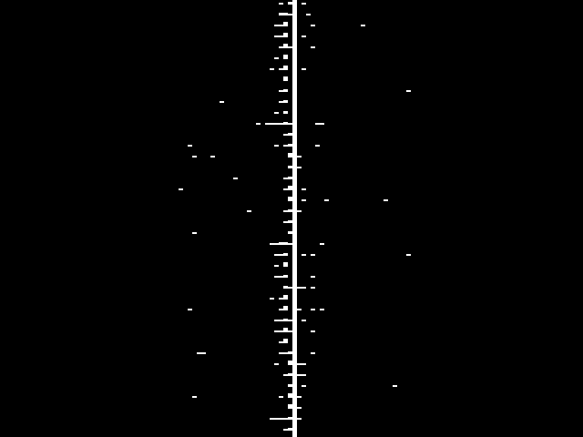
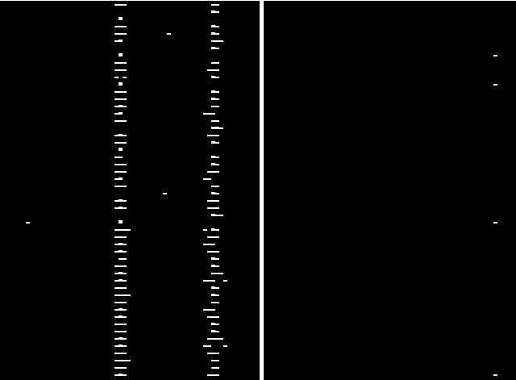
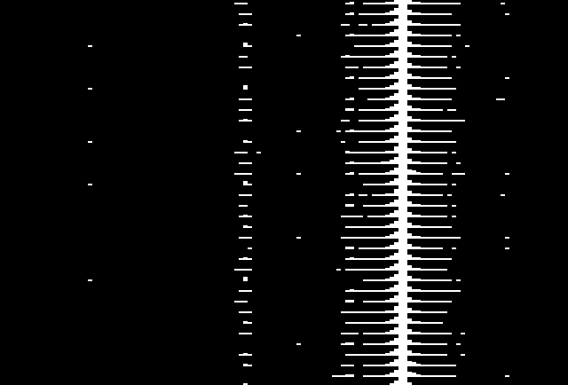
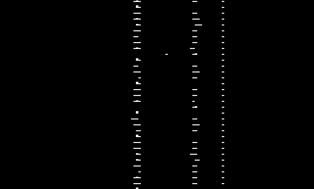
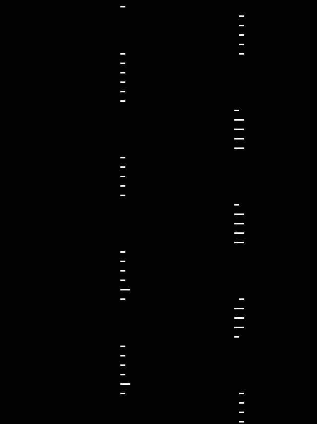
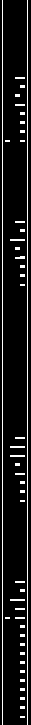

```
% quadrs
usage: quadrs \
    from [-sr SAMPLE_RATE] [-format cf32|cs8|cu8|cs16] FILENAME.sr32k.cf32 \
   shift [-]FREQUENCY \
 lowpass [-power 20] [-decimate 8] FREQUENCY \
sparkfft [-width 128] [-stride STRIDE] [-range LOW:HIGH]
   write [-overwrite no] FILENAME_PREFIX \
     gen [-cos FREQUENCY]* SAMPLE_RATE \


Formats:

 * cf32: complex (little endian) floats, 32-bit (GNU-Radio, gqrx)
 *  cs8: complex      signed (integers),  8-bit (HackRF)
 *  cu8: complex    unsigned (integers),  8-bit (RTL-SDR)
 * cs16: complex      signed (integers), 16-bit (Fancy)
Error: no commands provided
```

## Worked example: FSK

We've got a file with some FSK info in it. It was sampled at
`21M` samples per second, and is stored in complex little-endian
float format.

```
$ quadrs \
    from fsk-example.sr21M.fc32 \
    sparkfft
```



The data we're after is the "noise" to the left of the horrible DC bias
line in the centre.

First, let's zoom in horizontally. This is done with a decimating low-pass
filter. Here, the big number is the allowed frequency band, and the `-decimate`
is the factor by which to reduce the width. Ignore the frequency band for now:

```
$ quadrs \
    from fsk-example.sr21M.fc32 \
    lowpass -decimate 16 2000000 \
    sparkfft
```



Now we can see the FSK signal a bit! But we've ended up with random crap
on both sides, these are called "aliases", because our low-pass wasn't
aggressive enough. We'll fix that later:

First, let's centre it up:

```
$ quadrs \
    from fsk-example.sr21M.fc32 \
    shift 280000
    lowpass -decimate 16 2000000 \
    sparkfft
```



Notice how the shifting has ANGERED the DC bias bar into a wider bar.
We can punch our low-pass filter up a notch to shut it up again, by
increasing `power`, which is a work factor (bigger is better) and
narrowing the frequency:

```
$ quadrs \
    from fsk-example.sr21M.fc32 \
    shift 280000
    lowpass -power 200 -decimate 16 200000 \
    sparkfft
```



Now the FFT is letting us down!

Let's ask it to stretch vertically (by lowering `stride`),
and use a smaller `width`, increasing the apparent "resolution" of
small flickers of signal. To compensate for the reduced width, we can
`decimate` harder. And make the font bigger.

```
$ quadrs \
    from fsk-example.sr21M.fc32 \
    shift 280000 \
    lowpass -power 200 -decimate 32 200000 \
    sparkfft -width 64 -stride 16
```



Definitely looking like data now!

## Worked example: OOK in sed

`examples/cupoard-superdec.sr400.cf32` contains a super decimated recording of
[my temperature sensor](https://blog.goeswhere.com/2017/10/arduino-radio/).

We're expecting OOK, Manchester encoding, and a preamble of `00011` (after
Manchester).

First, I tuned the fft to be super small, and adjusted the range so it was blank
when the radio was off, and not when it wasn't:

```
$ quadrs \
    from cupboard-superdec.sr400.cf32 \
    sparkfft -width 4 -stride 2 -range 0.001:0.01 \
    | tee fft
```



Here we can already see bits, from the top it's `0101001011`. The computer doesn't
know that yet though.

I used sed to convert blank sections to `.`, and non-blank sections to `X`, then ran
the output through `uniq -c` to count the length of the runs.

```
$ <fft \
    | sed 's/^.    .$/./; s/....*/X/' \
    | tee bits
    | uniq -c

...

 8 .
 8 X
16 .
17 X
15 .
16 X
...
```

Here, we have eight `0`s, eight `1`s, sixteen `0`s etc. Again, easy to read as
`0100110011`. Note that the alignment is slightly off, as expected: not all values
are exactly 8 or 16.

We can get `egrep` and shell to estimate the pulse length for us. Take the first two
`XXX..oooo..` blocks from the preamble, and average their length:

```
$ <bits tr -d '\n' | egrep -o 'X{4,}o{4,}' | head -n 2 | tee first-two
XXXXXXXXoooooooo
XXXXXXXXoooooooo

$ echo $(($(<first-two tr -d '\n' | wc -c)/4))
8
```

Using this pulse length, and inserting some wiggle room, we can convert pulses back into
bits. This is actually pretty terrible, but better than my original C, and works for this
real data file I captured with a real radio.

```
# convert pulses into B (0) and A(1).
$ <bits tr -d '\n' | sed -E 's/X{6,10}/A/g; s/o{5,10}/B/g' | tee ab
XBBBBBBBBBBBBBBBBBBBBBBBBBBBBBABABABABABABBABAABABABBABAABABABABBAABABBABAABABBAABBAABABABABABABBAABBABBBBBBBBBBBBBooo
```

```
# strip the preamble of "[lots of Bs][lots of AB]BABA"
# split into pairs of digits
$ <ab sed -E 's/.*BBBBABAB(AB)*BABA//; s/../&_/g' | tee pairs
AB_AB_AB_BA_BA_AB_AB_AB_AB_BA_AB_AB_BA_BA_AB_AB_BA_AB_BA_AB_AB_AB_AB_AB_AB_BA_AB_BA_BB_BB_BB_BB_BB_BB_Bo_oo_%
```

```
# convert the pairs back into bits (AB is 0, BA is 1),
# and insert boundaries around bytes:
$ <pairs  sed -E 's/AB_/0/g; s/BA_/1/g; s/(.{8})(.)/\1^\2^/g'
00011000^0^10011001^0^10000001^0^1BB_BB_B^B^_BB_BB_B^B^_Bo_oo
```

This shows our bytes as `00011000` (24), `10011001` (153), and the parity byte
is visually correct. I didn't even cheat to make the example endian independent. Really.

And hence we have a temperature: 24 + (153 / 255) = 24.6°C.
